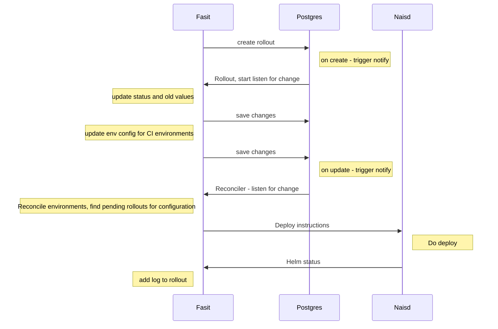
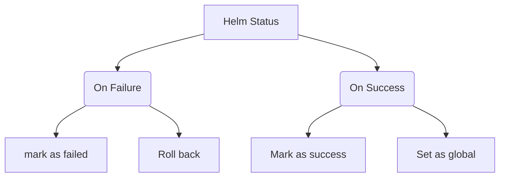

# Fasit-deploy action

An action that rolls out a new version of a fasit-feature to all environments.

## Preparing the feature in Fasit

In the feature.yaml file in fasit, you have to explicitly set which github organization and repository who's allowed to upgrade the feature.

```yaml
rolloutSource:
  - org: nais
    repo: up
```

## Usage

```yaml
name: Build and deploy image
jobs:
  rollout:
    needs: ["build_and_push"]
    runs-on: fasit-deploy
    permissions:
      id-token: write
    steps:
      - name: read sha
        id: sha
        run: echo "sha_short=$(git rev-parse --short HEAD)" >> $GITHUB_OUTPUT
      - uses: nais/fasit-deploy@main
        with:
          json: '{"image": {"tag": "sha-${{ steps.vars.outputs.sha_short }}"}}'
          feature_name: <feature_name>
```

## How it works





Fasit is not exposed to the internet, so the action runs on a github-runner on the private network in nais-io.

The action will authenticate with fasit using an [openIDConnect token](https://docs.github.com/en/actions/deployment/security-hardening-your-deployments/about-security-hardening-with-openid-connect)
