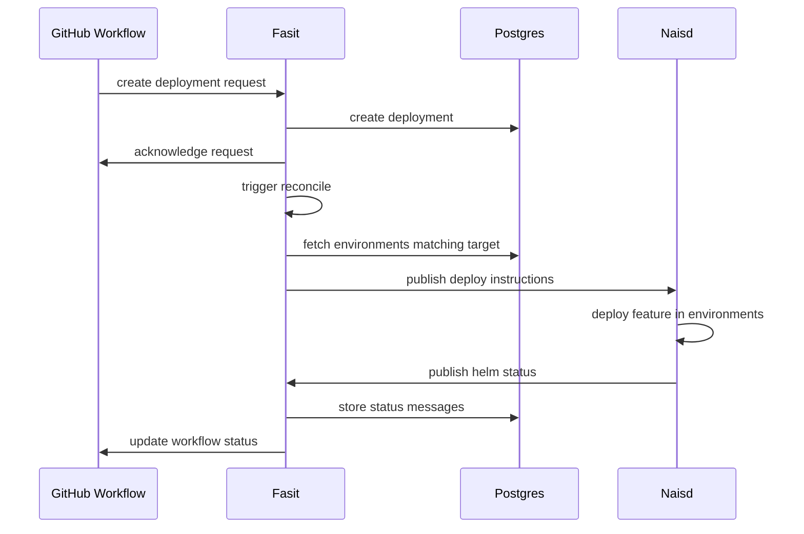

# Fasit-deploy action

An action that deploys a feature to a set of environments, targeted by the request.

## Usage

```yaml
name: Build and deploy image
jobs:
  deploy:
    needs: [build_push]
    runs-on: fasit-deploy
    permissions:
      id-token: write
    steps:
      - uses: nais/fasit-deploy@v4
        with:
          chart: # OCI Chart URL
          version: # Chart version
          targets: |
            [
              { "target": { "kind": "management", "tenant": "ci" }, "wait": true },
              { "target": { "kind": "management", "tenant": "nav" } }
            ]
```

Alternatively, point at a JSON file in your repository:

```yaml
      - uses: nais/fasit-deploy@v4
        with:
          chart: # OCI Chart URL
          version: # Chart version
          targets-file: ./targets.json
```

`targets` and `targets-file` are mutually exclusive; provide exactly one.

## Targets

Each entry in the `targets` list is an object:

- `target` (required) — a JSON object whose keys and values match Fasit environment labels. An empty object `{}` matches no filters.
- `wait` (optional, default `false`) — a boolean indicating whether the action should wait for that deployment to reach a terminal state (`DEPLOYED`, `DISABLED`, or `FAILED`) before continuing to the next entry.

The action POSTs one deployment to Fasit per entry, in order. If any deployment POST fails, or any `wait: true` deployment ends up in `FAILED`, the action exits non-zero and does not attempt subsequent entries.

Environment labels can be found in [Fasit](https://fasit.nais.io/labels).

## Waiting and timeouts

When `wait: true`, the action polls Fasit every 10 seconds for the deployment status until it reaches a terminal state. The terminal states are `DEPLOYED` and `DISABLED` (success) and `FAILED` (failure). The poll interval is hardcoded.

The `timeout-minutes` input controls how long the action will wait per `wait: true` target before giving up. Default: `10` (minutes). Set it lower for fast environments or higher for slow ones.

```yaml
- uses: nais/fasit-deploy@v4
  with:
    chart: # OCI Chart URL
    version: # Chart version
    timeout-minutes: 30
    targets: |
      [
        { "target": { "kind": "management", "tenant": "ci" }, "wait": true }
      ]
```

If a deployment fails or the timeout is reached, the step summary contains a link to the deployment in Fasit so you can inspect the per-environment statuses there.

## How it works


```mermaid
sequenceDiagram
    participant G as GitHub Workflow
    participant F as Fasit
    participant P as Postgres
    participant N as Naisd
    G->>F: create deployment request
    F->>P: create deployment
    F->>G: acknowledge request
    F->>F: trigger reconcile
    F->>P: fetch environments matching target
    F->>N: publish deploy instructions
    N->>N: deploy feature in environments
    N->>F: publish helm status
    F->>P: store status messages
    F->>G: update workflow status
```

Fasit is not exposed to the internet, so the action runs on a github-runner on the private network in nais-io.

The action will authenticate with fasit using an [openIDConnect token](https://docs.github.com/en/actions/deployment/security-hardening-your-deployments/about-security-hardening-with-openid-connect)

## v4 migration

Breaking changes from v3 to v4:

- **Removed inputs**: `google_service_account`, `workload_identity_provider`, `all-environments`, `global`, `skip-ci`, `target`, and `wait` are no longer accepted.
- **Removed feature**: Automatic `target` resolution from `chart/Feature.yaml` via helm pull is gone. The action no longer downloads the Helm chart or reads `Feature.yaml`.
- **New input shape**: A list of deployments is now provided via `targets` (inline JSON string) or `targets-file` (path to a JSON file). Each entry has its own `target` object and `wait` boolean. The action POSTs one deployment per entry, sequentially.
- **Action runtime changed**: The action now runs as a Node.js action (`using: node24`) instead of a composite shell action. No external tools (helm, gcloud) are required on the runner.
- **Whitespace handling**: `chart` and `version` inputs are now trimmed at the ends only (`.trim()`), rather than having all whitespace stripped as in v3.

**To migrate from v3:**

1. Replace your single `target` and `wait` inputs with a `targets` (or `targets-file`) input containing a JSON array of `{target, wait}` entries.
2. Remove `google_service_account`, `workload_identity_provider`, `all-environments`, `global`, and `skip-ci` from your `with:` block.
3. If you previously relied on automatic `target` resolution from `Feature.yaml`, add a pre-step that produces the `targets` JSON yourself.
4. If any `wait: true` deployment is slow, set `timeout-minutes` (default `10`).
5. Update the action reference from `nais/fasit-deploy@v3` to `nais/fasit-deploy@v4`.
