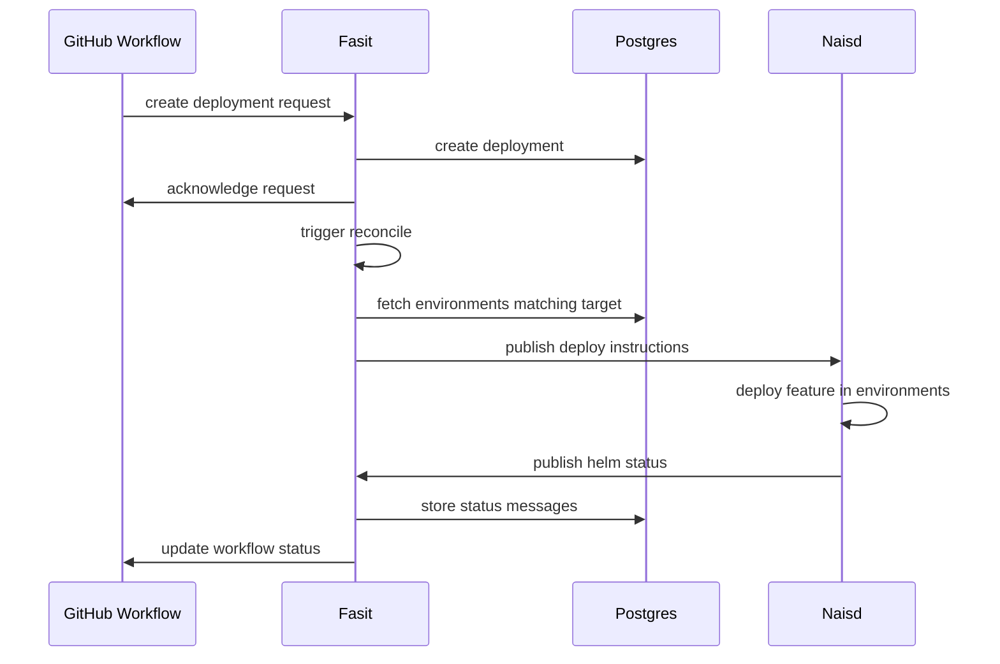

# Fasit-deploy action

An action that deploys a feature to a set of environments, targeted by the request.

## Usage

```yaml
name: Build and deploy image
jobs:
  deploy:
    needs: [build_push]
    runs-on: fasit-deploy
    permissions:
      id-token: write
    steps:
      - uses: nais/fasit-deploy@v3
        with:
          chart: # OCI Chart URL
          version: # Chart version
          target: '{"kind":"management","tenant":"nav"}' # optional
```

## Target environments

The `target` input is used to specify which environments the feature should be deployed to, by specifying a set of labels as a JSON object. The labels must match the target environment labels. Environment labels can be found in Fasit. `target` can be omitted, or be set to an empty object, in which case the feature will be deployed to all environments.

## How it works


```mermaid
sequenceDiagram
    participant G as GitHub Workflow
    participant F as Fasit
    participant P as Postgres
    participant N as Naisd
    G->>F: create deployment request
    F->>P: create deployment
    F->>G: acknowledge request
    F->>F: trigger reconcile
    F->>P: fetch environments matching target
    F->>N: publish deploy instructions
    N->>N: deploy feature in environments
    N->>F: publish helm status
    F->>P: store status messages
    F->>G: update workflow status
```

Fasit is not exposed to the internet, so the action runs on a github-runner on the private network in nais-io.

The action will authenticate with fasit using an [openIDConnect token](https://docs.github.com/en/actions/deployment/security-hardening-your-deployments/about-security-hardening-with-openid-connect)
