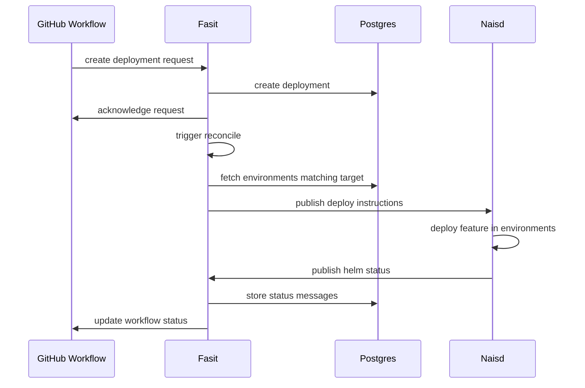

# Fasit-deploy action

An action that deploys a feature to a set of environments, targeted by the request.

## Usage

```yaml
name: Build and deploy image
jobs:
  deploy:
    needs: [build_push]
    runs-on: fasit-deploy
    permissions:
      id-token: write
    steps:
      - uses: nais/fasit-deploy@v4
        with:
          chart: # OCI Chart URL
          version: # Chart version
          target: '{"kind":"management","tenant":"nav"}'
```

## Target environments

The `target` input is required and must be a JSON object whose keys and values match Fasit environment labels.
Environment labels can be found in [Fasit](https://fasit.nais.io/labels).

An empty object `{}` deploys to all environments matching no filters.

## How it works


```mermaid
sequenceDiagram
    participant G as GitHub Workflow
    participant F as Fasit
    participant P as Postgres
    participant N as Naisd
    G->>F: create deployment request
    F->>P: create deployment
    F->>G: acknowledge request
    F->>F: trigger reconcile
    F->>P: fetch environments matching target
    F->>N: publish deploy instructions
    N->>N: deploy feature in environments
    N->>F: publish helm status
    F->>P: store status messages
    F->>G: update workflow status
```

Fasit is not exposed to the internet, so the action runs on a github-runner on the private network in nais-io.

The action will authenticate with fasit using an [openIDConnect token](https://docs.github.com/en/actions/deployment/security-hardening-your-deployments/about-security-hardening-with-openid-connect)

## v4 migration

Breaking changes from v3 to v4:

- **Removed inputs**: `google_service_account`, `workload_identity_provider`, and `all-environments` are no longer accepted.
- **Removed feature**: Automatic `target` resolution from `chart/Feature.yaml` via helm pull is gone. The action no longer downloads the Helm chart or reads `Feature.yaml`.
- **`target` is now required**: Must be a valid JSON object (e.g. `'{"kind":"management","tenant":"nav"}'`). An empty object `{}` is accepted and deploys to all environments.
- **Action runtime changed**: The action now runs as a Node.js action (`using: node24`) instead of a composite shell action. No external tools (helm, gcloud) are required on the runner.
- **Whitespace handling**: `chart` and `version` inputs are now trimmed at the ends only (`.trim()`), rather than having all whitespace stripped as in v3.

**To migrate from v3:**

1. Set `target` explicitly in your workflow `with:` block.
2. Remove `google_service_account`, `workload_identity_provider`, and `all-environments` from your `with:` block.
3. If you previously relied on automatic `target` resolution from `Feature.yaml`, add a pre-step to read and pass the target value yourself.
4. Update the action reference from `nais/fasit-deploy@v3` to `nais/fasit-deploy@v4`.
